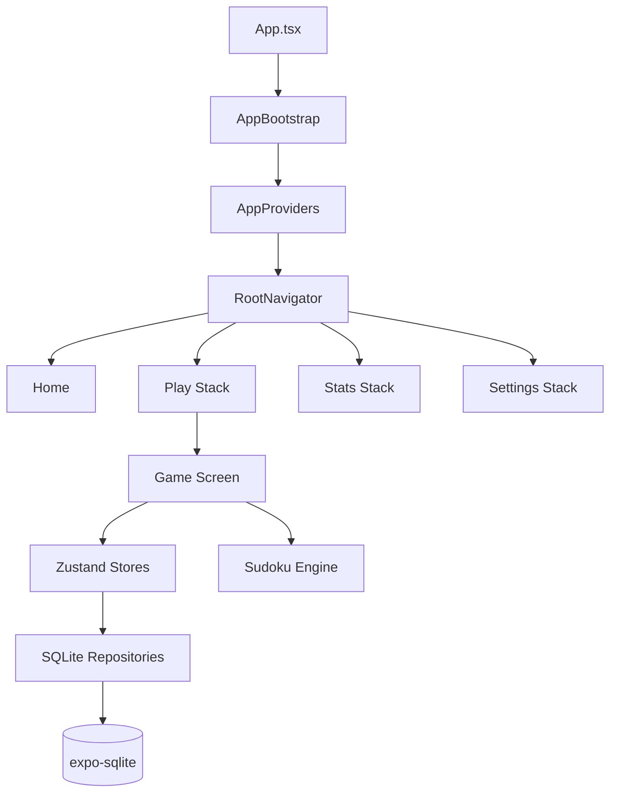

# Architecture

Sudoku Noir is structured around feature folders, with shared app infrastructure (theme, i18n, navigation) in `src/app`.

## High-level flow

## Layers

- UI: screens and UI kit components in `src/features` and `src/components`.
- State: `zustand` stores for game and settings.
- Data: SQLite repositories and migrations in `src/data`.
- Engine: Sudoku generator/solver in `src/features/game/engine`.

## Navigation

- Bottom tabs: Home, Play, Stats, Settings.
- Play stack: New Game → Game, Continue → Game.
- Stats stack: Statistics → History.
- Settings stack: Settings → About/Help/Learning/Privacy/Terms/Licenses.
